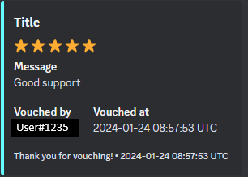

# Discord Vouch Bot - PYTHON



## Overview

Welcome to the Discord Vouch Bot project! This Python-based bot is designed to streamline the vouch process within Discord servers. Whether you're managing a gaming community, a development team, or any other type of group, this bot aims to simplify the vouch and feedback loop.

## Features

- **Message(Required)**: Leave a message.
- **Rating(Required)**: Rate between 1-5 stars.
- **Screenshot(Optional)**: Add a screenshot.

## Getting Started

1. **Installation**: Clone this repository and install the required dependencies using `pip install -r requirements.txt`.
2. **Configuration**: Set up your Discord bot token.
3. **Run the Bot**: Execute the `main.py` file to start the Discord Vouch Bot.

```bash
python main.py
```

## Commands

- **/vouch**: Submit a vouch with a message and a rating add a screenshot if needed.

---

*Happy Vouching!*